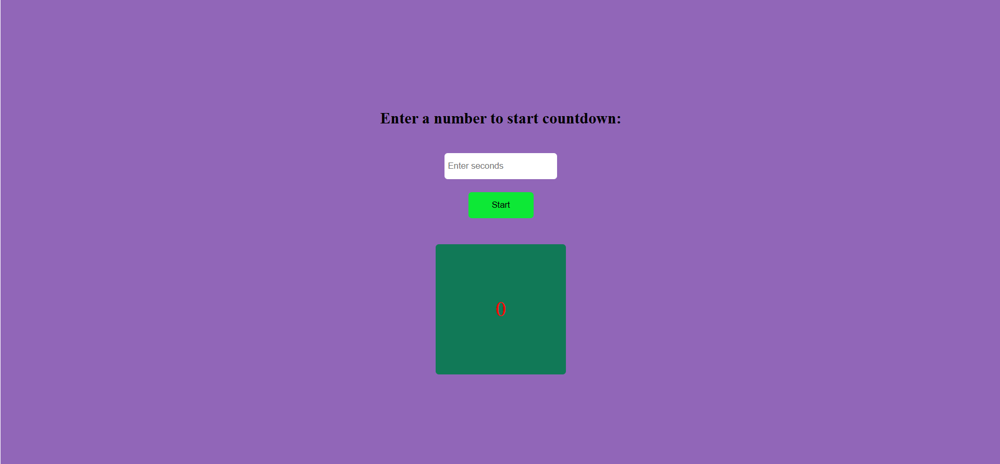
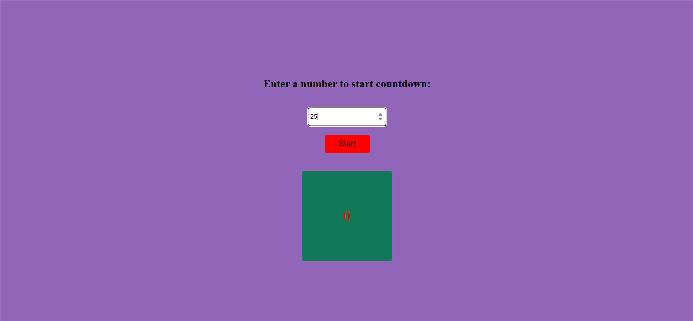
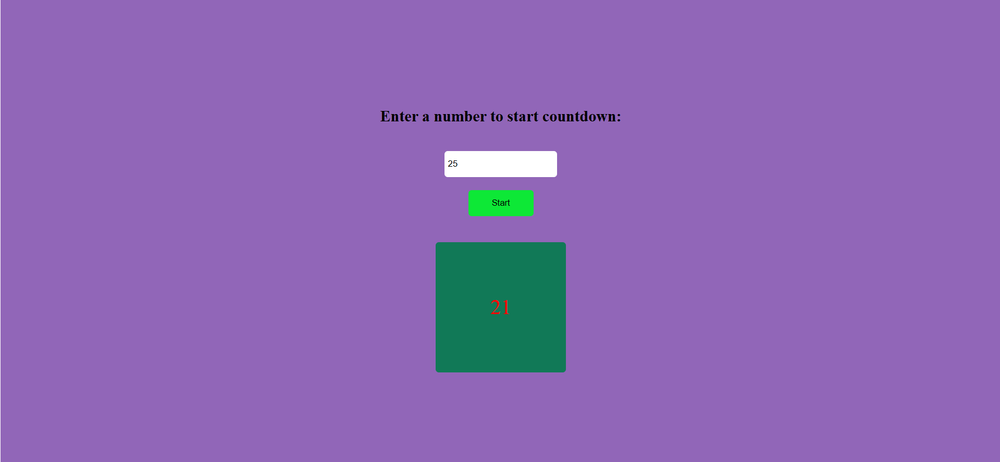
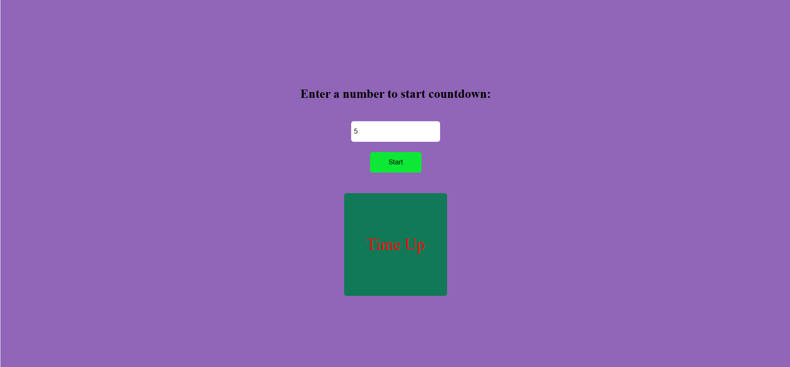

# user-input-countdown-timer
#⏱️ Countdown Timer

A simple web-based countdown timer built with HTML, CSS, and JavaScript.
Users can enter any number of seconds and start the timer, which counts down in real-time and displays "Time Up" when finished.

🚀 Features

Enter any custom countdown time.

Displays timer in a styled box at the center of the screen.

Shows "Time Up" message when the countdown ends.

Smooth styling with CSS Flexbox and transitions.

Built using vanilla JavaScript (setInterval, clearInterval, DOM manipulation

#🛠️ Technologies Used

HTML5

CSS3 (Flexbox, Transitions)

JavaScript (setInterval, clearInterval, DOM Manipulation)

#📚 Learning Highlights

Practiced JavaScript timing functions.

Learned how to manipulate the DOM dynamically.

Explored CSS centering with Flexbox and smooth transitions.

#📸 Demo Screenshot

